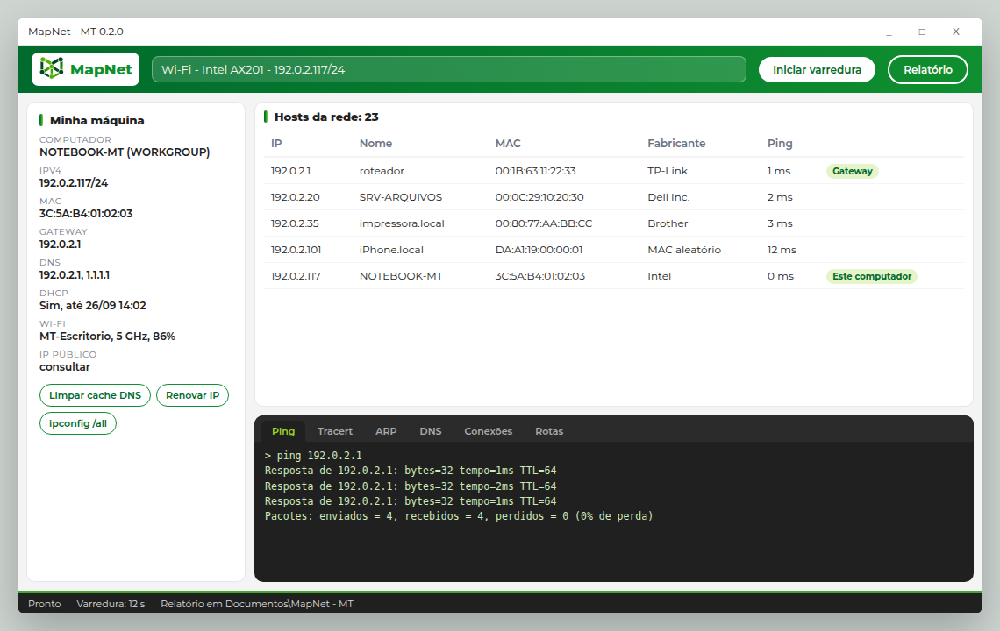

# MapNet - MT 0.2: painel do técnico

Data: 25/09/2026. Autor: Manfred Heil Junior. Complementa o desenho da versão 1 (`2026-09-25-mapnet-design.md`).

## 1. Por que a 0.2

A 0.1 funcionou no primeiro teste num Windows de verdade (placa Wi-Fi, com IP, gateway e DNS lidos certos). Em 25/09/2026, a 0.1.2 baixada da página nova abriu numa rede cabeada /21, leu a interface e limitou a varredura ao bloco /22 em volta do IP, como previsto. Mesmo assim, o Manfred apontou duas faltas:

1. **A janela não tem a cara da MT.** É um formulário cinza do Windows.
2. **Falta informação e ferramenta.** O técnico precisa ver tudo da própria máquina e ter à mão os comandos que um administrador de rede usa: ping, tracert, ARP, DNS, limpar cache DNS e outros.

## 2. Decisões

Todas do Manfred, em 25/09/2026, na conversa de desenho.

| # | Decisão | Escolha |
|---|---|---|
| 1 | Público | Técnico de TI de redes e suporte de computadores |
| 2 | Leiaute | **C, painel do técnico**: tudo numa tela (esboço em `img/2026-09-25-mapnet-0.2-leiaute-c.png`) |
| 3 | Tecnologia da tela | **WPF**, a mesma do CronoAula. O núcleo não muda |
| 4 | Informações e comandos | A lista das seções 4 e 5, aprovada como proposta |
| 5 | IP público | Botão separado, só quando o técnico clicar. É a única função que sai para a internet |
| 6 | Execução do console | **Misto**: diagnóstico com código próprio, manutenção pelos comandos oficiais do Windows |
| 7 | Detalhe do host | **Entra**: clique no host abre um painel à direita com os dados e as ações |
| 8 | Nome | **MapNet - MT**, com `mapnet.exe`, repositório `manfredjr/mapnet` e página `mapnet.manfred.com.br`. A troca saiu na v0.1.2 |

## 3. Leiaute

O esboço usa endereços reservados para documentação (192.0.2.x) e nomes inventados.

- **Faixa do topo**, verde com o gradiente da MT: logo do MapNet, seleção da interface, botões **Iniciar varredura** e **Relatório**.
- **Coluna esquerda, "Minha máquina"**: as informações da seção 4 e os botões de manutenção da seção 5.
- **Centro, "Hosts da rede"**: a tabela da varredura, com filtro e ordenação.
- **Painel de detalhe**, à direita da tabela: abre ao clicar num host e fecha com novo clique ou com Esc. Traz MAC, fabricante, nomes (DNS, NetBIOS, mDNS), grupo de trabalho, TTL e, quando a fatia de portas existir, as portas abertas. As ações são ping contínuo, tracert, abrir no navegador (http e https), área de trabalho remota, pasta compartilhada (`\\host`) e copiar os dados.
- **Console embaixo**, grafite, com abas Ping, Tracert, DNS, ARP, Conexões e Rotas. É onde aparece a saída de toda ferramenta e ação.
- **Barra de estado**, grafite com a faixa verde: andamento, tempo da última varredura e onde o relatório foi gravado.

Identidade visual igual à do site da MT: verdes `#006B2D`, `#0F8F2F`, `#43A92C` e `#9AD52B`, grafite `#202020`, cinza-claro `#F4F4F4`, fonte Montserrat embutida no `.exe` (licença SIL OFL 1.1), botões em pílula e cartões com borda arredondada.

## 4. Painel "Minha máquina"

Tudo sem administrador.

| Informação | Fonte |
|---|---|
| Nome do computador, grupo de trabalho ou domínio, usuário logado | `Environment`, `IPGlobalProperties` |
| Placa escolhida: nome, tipo, MAC, velocidade do link, MTU | `NetworkInterface` |
| IPv4 com máscara, IPv6, gateway, DNS, sufixo DNS | `IPInterfaceProperties` |
| DHCP: ligado ou fixo, servidor, validade da concessão | `IPInterfaceProperties` e `GetAdaptersInfo` |
| Wi-Fi: SSID, banda, canal, sinal | API nativa de WLAN (`wlanapi.dll`), que não depende do idioma do Windows. No Windows 11 recente pode exigir a Localização ligada, e o painel avisa quando for o caso |
| IP público | Botão **Consultar IP público**, sob demanda (serviço a confirmar, seção 8) |

## 5. Console e ações

**Diagnóstico com código próprio** (saída em português, igual em qualquer Windows, com resumo que pode ir ao relatório):

| Ferramenta | Como |
|---|---|
| Ping, normal e contínuo | `System.Net.NetworkInformation.Ping`, com perda, mínimo, média e máximo |
| Tracert | Ping com TTL crescente, mostrando cada salto com tempo e nome |
| Consulta DNS com escolha do servidor | Pergunta DNS por UDP 53 montada pelo núcleo, que já interpreta pacotes DNS no mDNS |
| Tabela ARP (ver) | `GetIpNetTable2` do `iphlpapi` |
| Conexões abertas | `GetExtendedTcpTable` e `GetExtendedUdpTable`, com o processo dono quando o Windows permitir |
| Tabela de rotas | `GetIpForwardTable2` |
| `ipconfig /all` | Comando do Windows, com botão de copiar |

**Manutenção pelos comandos oficiais do Windows**, com a saída mostrada no console:

| Ação | Comando | Administrador |
|---|---|---|
| Limpar cache DNS | `ipconfig /flushdns` | A confirmar no teste. Se pedir, eleva |
| Liberar e renovar IP | `ipconfig /release` e `ipconfig /renew` | Sim |
| Limpar tabela ARP | `netsh interface ip delete arpcache` | Sim |
| Resetar Winsock e pilha TCP/IP | `netsh winsock reset` e `netsh int ip reset` | Sim. Avisa que pede reiniciar |

**Como a elevação funciona:** o programa continua abrindo como usuário comum. Uma ação que precisa de administrador pede confirmação, e então o próprio `mapnet.exe` é aberto num modo auxiliar com elevação (a tela do UAC aparece). Esse modo roda só o comando oficial pedido, grava a saída num arquivo temporário e termina. A janela principal lê a saída e mostra no console. Nenhuma outra parte do programa roda como administrador.

Ações que mexem na rede (renovar IP, reset do Winsock) pedem confirmação com o texto do que vai acontecer, porque derrubam a conexão por alguns segundos.

## 6. Arquitetura

- **Núcleo** (`src/mapnet.nucleo`): recebe os módulos novos de diagnóstico (ping com estatística, tracert, DNS com servidor escolhido, tabelas ARP, conexões e rotas), a leitura detalhada da máquina e a execução de comandos com captura da saída. Tudo testável sem janela, com as chamadas ao Windows atrás de interfaces para os testes.
- **Aplicativo** (`src/mapnet`): troca WinForms por WPF (`UseWPF`). A tela segue o padrão de visão e modelo de visão (MVVM leve, sem biblioteca externa). O modo linha de comando continua igual, no mesmo `.exe`.
- **Relatório HTML**: ganha a seção "Minha máquina" e, quando o técnico pedir, o resultado das ferramentas rodadas.

## 7. Fatias

A antiga ordem (portas, identificação leve, classificação, relatório completo) passa para depois da 0.2.

| Fatia | Conteúdo |
|---|---|
| 2 | Tela WPF com o leiaute C e a identidade da MT, com a varredura atual. Substitui o WinForms |
| 3 | Painel "Minha máquina" completo, inclusive Wi-Fi e IP público sob demanda |
| 4 | Console de diagnóstico: ping, tracert, DNS, ARP, conexões, rotas, `ipconfig /all` |
| 5 | Ações de manutenção com elevação sob demanda |
| 6 | Painel de detalhe do host com as ações |
| 7 em diante | Portas TCP, identificação leve, classificação e relatório completo (desenho da versão 1) |

Cada fatia sai numa versão 0.2.x publicada, para o Manfred testar no campo entre uma e outra.

## 8. A confirmar

| Item | Recomendação |
|---|---|
| Serviço do IP público | `https://1.1.1.1/cdn-cgi/trace`, do Cloudflare, que a MT já usa. Responde texto simples e não exige cadastro |
| `ipconfig /flushdns` pede administrador? | Testar na fatia 5, no Windows do Manfred, e documentar |
| Licença e LGPD | Seguem na pendência do enquadramento jurídico pela `legal-br`. A 0.2 não coleta dado novo além do que a máquina do próprio técnico mostra |

## 9. Prioridade dos testes

1. Interpretação das respostas de rede (DNS, tracert, tabelas do Windows) com dados montados, inclusive malformados.
2. A elevação só roda comandos de uma lista fechada. Nenhum texto vindo da tela vira comando.
3. Estatística do ping e do tracert.
4. O que já existe continua passando: varredura, relatório, ícone, página.

## 10. Fora da 0.2

- Faixa manual e outras sub-redes.
- IPv6 na varredura (o painel "Minha máquina" mostra o IPv6 da placa, mas a varredura segue só IPv4).
- Varredura agendada e comparação entre varreduras.
- Assinatura digital do `.exe`, que segue como decisão pendente.
